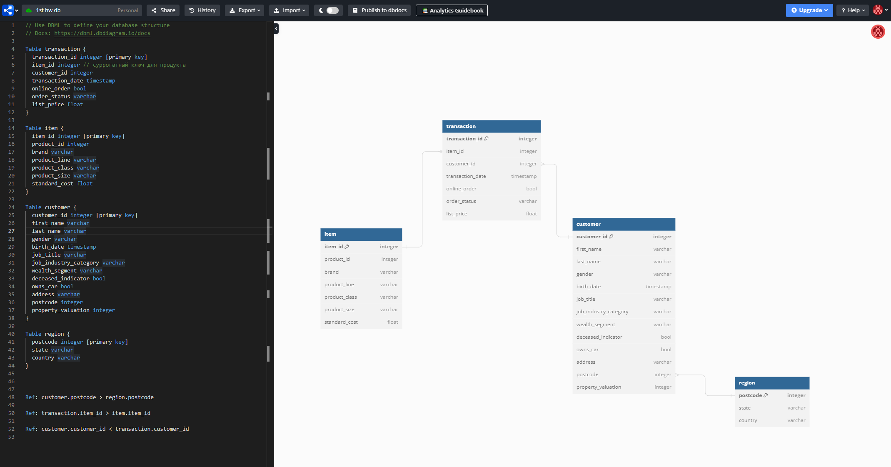

# HW 1. Создание и нормализация базы данных
### Студент: Яськова Марина Андреевна
## Задание
Дан файл с данными по клиентам и транзакциям. Необходимо:
1. [Продумать структуру базы данных и отрисовать в редакторе.](#1-структура-базы-данных)
2. [Нормализовать базу данных (1НФ — 3НФ).](#2-нормализация)
3. [Создать все таблицы в DBeaver.](#3-создание-таблиц-в-dbeaver)
4. [Загрузить данные в таблицы в соответствии с созданной структурой.](#4-загрузка-данных-в-таблицы)
## Решение
### 1. Структура базы данных

### 2. Нормализация
Структура выше — результат нормализации. Категориальные переменные не выносились в отдельные таблицы-"словари" по итогам обсуждения в чате дисциплины.
#### 1НФ
Обе исходные таблицы уже в 1НФ: все атрибуты простые, все данные скалярные. Однако в двух столбцах таблицы customer есть явная избыточность данных:
1. Столбец **gender**: 2 обозначения мужского рода (M, Male) и 3 обозначения женского (F, Femal, Female). Приведем их к единой форме Female и Male. Третий гендер, присутствующий в данных, "U" — это обозначение небинарных персон, и он так и пишется (U-gender), поэтому его оставляем как есть.
2. Столбец **state**: 5 уникальных значений (New South Wales, NSW, QLD, VIC, Victoria), однако на самом деле штатов в данных только 3, что можно проверить при помощи postcode. Унифицируем, получаем 3 сокращенных названия NSW, QLD, VIC.
#### 2НФ
В таблице **transaction** оставляем только столбцы, описывающие транзакции и зависящие от transaction_id (transaction_id, customer_id, transaction_date	online_order, order_status, list_price). Остальные столбцы относятся к другой сущности — продукту, поэтому их выделяем в отдельную таблицу, назовем ее **item**.

При этом product_id не является уникальным ключом. Однозначно определить тип товара можно только по совокупности всех 5 столбцов. Поэтому в таблице **item** избавляемся от дубликатов и всем уникальным сочетаниям 5-ти признаков присваиваем суррогатный ключ, item_id. В таблице **transaction** мы будем ссылаться именно на него.

***Примечание:** анализ данных и разбиение на таблицы в основном велись в графическом интерфейсе Excel, однако проставлять соответствующие ключи item_id в таблице **transaction** удобнее с помощью pandas. Это было сделано уже после разбиения excel на csv-файлы, код можно посмотреть [в ноутбуке "tables_edit.ipynb"](tables_edit.ipynb).*

В таблице **customer** столбцы state и country можно однозначно определить по postcode, поэтому выносим их в отдельную таблицу, назовем ее region. Ключ — postcode. Оставшиеся столбцы таблицы зависят от первичного ключа.

Таким образом, БД приведена во вторую нормальную форму.

#### 3НФ
Все 4 таблицы также находятся в третьей нормальной форме.

Комментарии по столбцам, которые могут вызвать вопросы:
* В таблице **item** зависимости между столбцами не прослеживаются, поэтому все уникальные комбинации зависят только от сгенерированного ключа item_id. Особенность данных.
* В таблице **customer** были гипотезы о связи столбцов job_title и job_industry_category, а также столбцов wealth_segment и property_valuation. Обе гипотезы не подтвердились.
* В таблице **region** есть взаимосвязь между столбцами state и country. Однако для идентификации конкретной строки данных достаточно ключа postcode. Кроме того, в данных всего одна страна, поэтому нет смысла выносить соответствие стран и штатов в отдельную таблицу.

### 3. Создание таблиц в DBeaver
SQL-код был выполнен в редакторе DBeaver. Файл со скриптом лежит по [ссылке](creating_tables_sql.sql).

### 4. Загрузка данных в таблицы
Загрузку сделала через интерфейс DBeaver (импорт csv).

